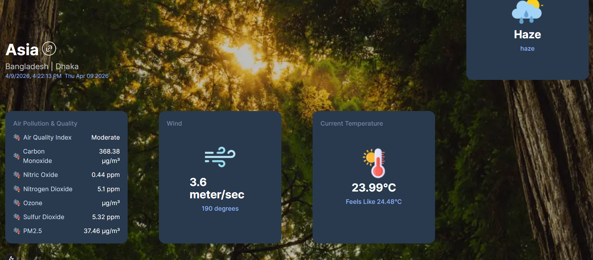

````markdown
# 🌦️ Weather Monitoring App

A modern and responsive **Weather Monitoring Application** built using **Next.js** and **React.js**.  
This project provides **real-time weather information** including temperature, wind speed, air conditions, and current weather status using an external weather API.

This project was developed as a **University Project** to practice **API integration**, **Next.js development**, and **dynamic UI rendering**.

---

# 🚀 Project Overview

This project includes:

- Real-time weather updates
- Current temperature display
- Wind speed monitoring
- Air condition information
- Weather status (Sunny, Rainy, Cloudy, etc.)
- Clean and responsive user interface

---

# ⚙️ Technology Used

- Next.js
- React.js
- OpenWeather API
- JavaScript (ES6+)
- CSS / Tailwind CSS

---

# 🧰 Features

- 🌡️ Real-time temperature monitoring
- 🌬️ Wind speed display
- ☁️ Weather condition indicator
- 🌍 Location-based weather data
- 📱 Fully responsive design
- ⚡ Fast loading performance
- 🔄 Dynamic weather updates
- 🧭 Clean UI and user-friendly layout

---

# 📸 Project Screenshots

## 🏠 Homepage



---

# 🎯 Learning Outcomes

Through this project, I learned:

- API integration with Next.js
- Handling asynchronous data
- Component-based architecture
- Responsive UI design
- Error handling in API requests
- Dynamic data rendering
- Next.js project structure
- Environment variables usage

---

# 🚀 Future Improvements

- Add search by city name
- Add 7-day weather forecast
- Add hourly weather updates
- Add dark/light mode toggle
- Add multiple location support
- Improve UI animations
- Add loading skeleton

---

# ⚙️ How to Run the Project

Clone the repository

```bash
git clone https://github.com/your-username/weather-monitoring.git
```
````

Go to project folder

```bash
cd weather-monitoring
```

Install dependencies

```bash
npm install
```

Run development server

```bash
npm run dev
```

Open in browser

```
http://localhost:3000
```

---

# 👨‍💻 Author

**MD. Raful Mia**
University Project
**JKKNIU ([Jatiya Kabi Kazi Nazrul Islam University](https://www.jkkniu.edu.bd/))**
CSE Department

---

# ⭐ Support

If you like this project, give it a ⭐ on GitHub.

```

```
